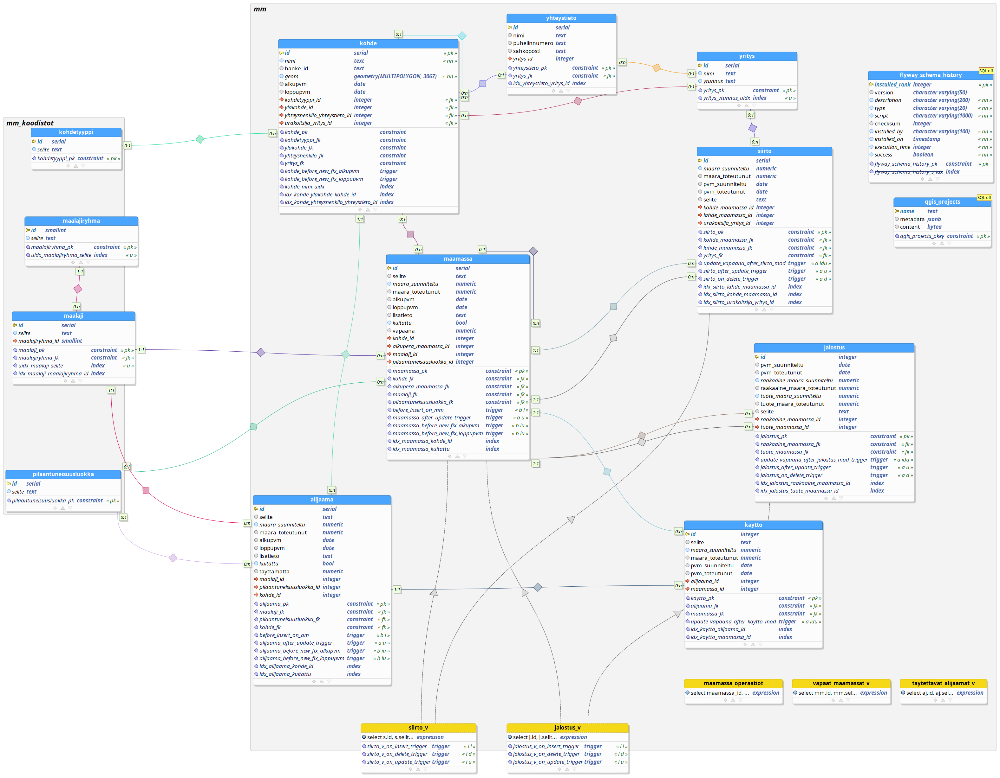

# Municipal asset inventory (Finland) 

## Database model


[docs/db/schema.png](docs/db/schema.png)


## Set up a dev environment

1. Copy .env.template to .env 

```bash
docker-compose up -d
docker-compose up flyway
```
## Exporting sql file from the database model
In order for the sql to work with setting up a database either with the plugin or docker compose/flyway some modifications to the sql file is required. The following lines should be commented (with --):

```code
CREATE ROLE infrao_admin WITH 
	CREATEROLE
	LOGIN;
```
```code
CREATE DATABASE infrao
	TABLESPACE = pg_default
	OWNER = infrao_admin;
```
```code
CREATE SCHEMA kohteet;
```
```code
CREATE EXTENSION postgis
WITH SCHEMA public;
```


## Handling database model changes
The diff operation in pgModeler is quite fragile and not recommended used directly.

We use Flyway (for now) to generate database migrations. Flyway is a SQL file based migration system.
PgModeler is used to generate diff SQL files and then apply Flyway migration.


### Creating incremental migrations
1. Verify db is up to date by running `docker-compose up flyway`
2. Modify the pgmodeler model
3. Modify accordingly and run `pgmodeler-cli.exe --diff --save --input infrao.dbm --compare-to infrao --conn-alias local-db --output migrations/V2__add_viheralue_table.sql --pgsql-ver 14.0`
4. Validate and modify the migration file
5. Migrate by running `docker-compose up flyway`

Or alternatively use `./diff.bat`  
```bash
./diff.bat V2__description
```
### Running migrations to a spesific version
`docker-compose run --rm flyway migrate -target="1.1.0"`

### Running migrations against different platform
`docker-compose run --rm -e FLYWAY_USER=infrao_admin -e FLYWAY_PASSWORD=<password> -e FLYWAY_URL=jdbc:postgresql://trepx-paikka1.tre.t.verkko:5432/omaisuudenhallinta_test_db flyway migrate`

## Exporting database documentation:

```
psql -p 5434 -d infrao -U infrao_admin -f .\docs\db\generate_docs.sql
```
## Export db model to png
```
& 'C:\Program Files\pgModeler\pgmodeler-cli.exe' --export-to-png --input .\db\infrao.dbm --output .\docs\db\schema.png
```
Or in Linux, accordingly:
```
/opt/pgModeler/pgmodeler-cli --export-to-png --input db/infrao.dbm --output docs/db/schema.png
```

