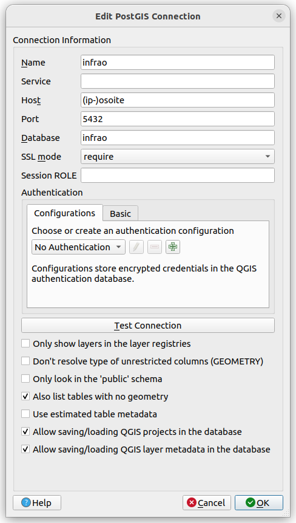
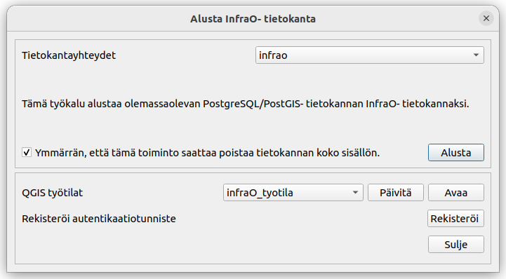

# 3. QGIS-toimintaympäristön rakentaminen

Tässä osiossa käydään läpi toimet QGIS-toimintaympäristön käyttöönottoon.

## 3.1. Infra-O lisäosan asentaminen

Infra-O lisäosa mahdollistaa kolme toimintoa:

-   Infra-O skeeman mukaisen tietokantarakenteen alustamisen

-   Infra-O skeeman mukaisen tiedon vieminen (exportointi) XML tai GML tiedostoihin

-   Infra-O skeeman mukaisen tiedon tuominen (importointi) XML tai GML tiedostosta tietokantaan

Lisäosan käyttö tai asentaminen **ei** ole välttämätöntä tiedon tuottamisessa tai ylläpidossa. Se kuitenkin helpottaa toimintaympäristön pystyttämisessä ja käyttöönotossa.

### 3.1.1. Asennus QGISin lisäosarepositoriosta

Infra-O lisäosan voi asentaa suoraan QGISin virallisesta lisäosarepositoriosta. Lisäosia voi asentaa QGISin käyttöliittymästä **Lisäosat** -\> **Hallitse ja asenna lisäosia** -\> **Kaikki**- välilehti. Kirjoita hakukenttään esim. 'infrao' ja lisäosan pitäisi näkyä listassa. Valitse **Infra-O plugin** ja klikkaa **Asenna lisäosa**.

### 3.1.2. Asennus GitHub repositoriosta

Asennuksen voi tehdä myös lataamalla .zip tiedoston lisäosan [GitHub- repositoriosta](https://github.com/GispoCoding/infrao-plugin). Valitse oikealta **Releases** -\> Uusin julkaisu -\> **Assets** -\> <b>infrao-v.\*.zip</b>.

Avaa yllä kuvattu **Hallitse ja asenna lisäosia**- ikkuna. Valitse **Asenna ZIP-tiedostosta**- välilehti. Hae lataamasi ZIP tiedosto ja klikkaa **Asenna lisäosa**.

## 3.2. Tietokanta

Toimintaympäristöä varten tarvitaan PostgreSQL- tietokantaklusteri. Klusteriin on suositeltavaa luoda infraomaisuuden hallintaa varten oma tietokanta esimerkiksi nimeltä 'infrao'. Infrao-tietokantaan tulee asentaa PostGIS- liitännäinen. Tietokannan omistajaksi ja ylläpitäjäksi voidaan luodaan oma käyttäjä, esimerkiksi 'infrao_admin'. Tietokantaan voi luoda myös muita käyttäjiä tai rooleja. Tiedon tuottaminen, hallinnointi ja lisäosan muiden toimintojen (tietojen vieminen tai tuominen) vaatii vähintään oikeuden valita (SELECT) ja lisätä (INSERT) infrao- tietokannan tauluihin.

### 3.2.1. Huomioitavaa tietokannasta

Toimintaympäristön tietokantarakenteen voi luoda QGISin Infra-O lisäosalla. Tähän tarvitaan käyttäjätunnukset infrao- tietokantaan, jolla on oikeus lisätä skeemoja, tauluja ja sekvenssejä. Lisäksi QGIS- projektin lisääminen tietokantaan vaatii oikeuden lisätä tauluja infrao- tietokannan public- skeemaan. Mikäli käyttäjällä on superuserin oikeudet, PostGIS- liitännäisen lisääminen tietokantaan onnistuu suoraan lisäosan työkalulla. PostGISin voi asentaa kuitenkin myös etukäteen.

Tietokantarakenteen voi luoda myös manuaalisesti hyödyntämällä [infraO-open repositorion](https://github.com/GispoCoding/infraO-open) tietokanta- skriptiä. Tällöin Infra-O -QGIS projektia ei kuitenkaan lisätä automaattisesti tietokantaan.

## 3.3. Yhteyden muodostaminen tietokantaan

Käyttäjille annetaan ohjeet yhteyden muodostamiseksi PostgreSQL-tietokantaan, oli se sitten paikallisesti tai etäpalvelimella. Tämä vaihe mahdollistaa käyttäjien pääsyn tietoihinsa ja saumattoman tiedon luomisen ja hallinnan.

### 3.3.1. Tietokantayhteyden tallentaminen

Tässä on ohjeet PostgreSQL-/PostGIS-yhteyden lisäämiseen QGIS:iin ja QGIS-projektin avaamiseen ko. tietokannasta:

Avaa QGIS-ohjelma tietokoneellasi.

Klikkaa "PostgreSQL" -kuvaketta "Tietolähteiden hallinta" -valikossa. Klikkaa "Uusi". Anna nimeksi esimerkiksi 'infrao' ja täytä muihin kenttiin tietokantapalvelimen tiedot:

## 3.4. Tietokantarakenne lisäosalla

Kun tietokantayhteys on tallennettu, tietokantarakenne voidaan luoda lisäosalla. Avaa työkalu **Lisäosat** -\> **Infra-O plugin** -\> **Alusta tietokanta**. Valitse 'Tietokantayhteydet' kenttään yhteys infrao-tietokantaan. Klikkaa sitten **'Alusta'**. Jos määritellyllä käyttäjällä on riittävät oikeudet, tietokantaan lisätään Infra-O tietomallin mukainen rakenne. Tietokantaan lisätään myös QGIS- projekti (työtila). Työtilan pitäisi päivittyä **'QGIS työtilat'**- kenttään. Työtilan voi avata klikkaamalla **'Avaa'**.

### 3.4.1. Todennusasetusten rekisteröinti

Kun tietokantarakenne luodaan, QGISin autentikaatiotietokantaan tallentuu autentikaatioasetukset tietokantayhteyden mukaisesti. Autentikaatioiden tunnisteeksi asetetaan tietokantayhteyden nimi. Tämä tietokantayhteyden nimi muokataan myös QGIS- projektin tasojen datalähteen tietoihin. Tietokantarakentaan luojalle autentikaatioasetukset tallentuvat automaattisesti.

**Jos tietokantaa hyödyntää useampi käyttäjä, jokaisella käyttäjällä tulee olla tallennettuna autentikaatioasetus samalla tunnisteella.** Itse kirjautumistiedot voivat olla kuitenkin erit. Tämä mahdollistaa tietokannan yhteiskäytön eri käyttäjätunnuksilla. **Alusta tietokanta**- työkalulla myös muut käyttäjät voivat rekisteröidä autentikaatioasetuksensa QGISin autentikaatiotietokantaan. Klikkaa 'Alusta tietokanta'- ikkunassa **'Rekisteröi'** painiketta ja täydennä tarvittaessa käyttäjänimi ja salasana. Täytä autentikaatiotunniste- kenttään QGIS- projektin tietolähteiden 'authcfg' parametrin arvo (alkuperäinen tietokantarakenteen luomisessa käytetty tietokantayhteyden nimi).

### 3.4.2. Todennusasetusten määrittäminen yhteydelle

Lisäosan käyttöä helpottaa, jos tietokantayhteydelle määritetään autentikaatioasetukset. Muokkaa yhteyttä ja valitse todennusasetukseksi rekisteröimäsi todennusasetus.
