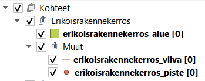

# Yleiskatsaus QGIS-toimintaympäristön toiminnallisuuksiin

QGIS-toimintaympäristö mukailee normaalia QGIS-projektia tasoineen ja työkaluineen.

## Pääryhmät

Tasot on jaoteltu ryhmiin tyypeittäin (Kohteet, Kasvillisuus, Varusteet, Viheralue, Katualue, Taustakartat, Linkit). Näiden ryhmien sisältä löytyy varsinaiset infraomaisuuden kohteet, joiden tietoja tallennetaan järjestelmään.

## Tasot

Jokaista infraomaisuustyyppiä kohden on kolme tasoa, jotka sijaitsevat omassa ryhmässä. Näiden tasojen geometria on erilainen (piste, viiva tai alue). Yleisimmin käytetty geometria on listattu ensimmäisenä.

Harvemmin käytetyt geometriatyypit löytyvät ryhmän 'Muut' alikansiosta. Näin tarvittaessa esimerkiksi liikennemerkin voi halutessaan tallentaa viivaksi tai alueeksi.