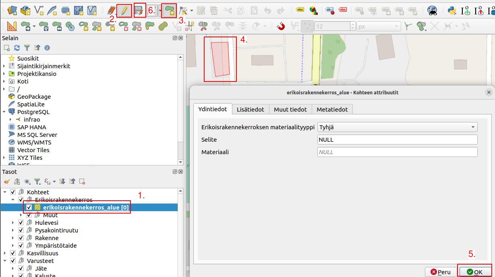

# 6. Tiedon tuottaminen QGIS-toimintaympäristössä

Luvussa esitellään QGIS-toimintaympäristön työkalut ja toiminnot, jotka mahdollistavat tehokkaan tietojen tuottamisen ja tarkentamisen infraoomaisuuden tietojen hallintaa varten.

## 6.1. Digitointi

Tietoa voidaan tuottaa QGISin digitointityökaluilla.

1.  Valitse taso, johon haluat lisätä kohteita.
2.  Klikkaa tason editointitila päälle (kynä-ikoni).
3.  Klikkaa **Lisää kohde**- painiketta.
4.  Piirrä (digitoi kohde) kartalle.
    -   Lopeta digitointi hiiren oikealla painikkeella (pistetasolla vasen)

    -   Täytä avautuvaan lomakkeeseen kohteen tiedot.
5.  Paina OK.
6. Tallenna muutokset levykkeen kuvasta.

## 6.2. Mahdolliset tietolähteet tiedon tuottamisen tueksi

Käyttäjät voivat hyödyntää olemassa olevia paikkatietoaineistoja ja muita tietolähteitä tiedon tuottamiseen. Esimerkiksi kansallisista aineistoista, kuten avoimen datan Digiroad-aineistosta voi olla apua tiedon tuottamisessa. Lisäksi kaupunkien ja kuntien CAD-aineistot voivat olla käyttäjän avuksi. Huom. kysessä olevan QGIS-toimintaympäristö ei automaattisesti tuo edellä mainittujen aineistojen hyödyntämistä, vaan niiden käyttö vaatii aina erillistä työtä käyttäjältä tai lisäarvopalvelun tarjoajalta.
