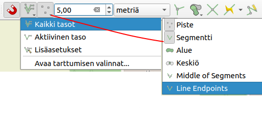

# 7. Tietojen hallinta ja editointi

Luvussa esitellään luotujen tietokohteiden käsittelyä ja työkaluja, joiden avulla käyttäjät voivat tehokkaasti hallita ja päivittää kohteiden attribuuttitietoja.

## 7.1. Editointi

Tietoa voidaan muokata QGISin editointityökaluilla.

1. Valitse taso, jonka kohteita haluat muokata.
2. Klikkaa tason editointitila päälle.
3. Ota käyttöön valintatyökalu
4. Valitse kohde/kohteet, jota haluat muokata
5. Avaa lomake.
6. Muokkaa kohteen tietoja.
7. Paina OK.
8. Tallenna muutokset.

## 7.2. Kohteen tiedot- työkalu

Voit tarkastella ja muokata kohteiden tietoja **Näytä kohteen tiedot**- työkalulla.

1. Valitse työkalu.
2. Valitse kohde.
3. Tarkastele tietoja.
4. Jos tason editointitila on päällä, voit avata lomakkeen ja muokata tietoja.

## 7.3. Tarttumisen asetukset

1. Valitse QGISistä **Näytä** -> **Työkalut** -> **Tarttumisen asetukset**
2. QGIS- ikkunaan tulee näkyviin tarttumisen työkalupalkki.
3. Määritä asetukset esimerkiksi kuvan mukaisesti

4. Nyt digitoidessa hiiri tarttuu olemassa oleviin kohteiden taitepisteisiin sekä segmentteihin. Tämä helpottaa etenkin vierekkäisten kohteiden digitointia
