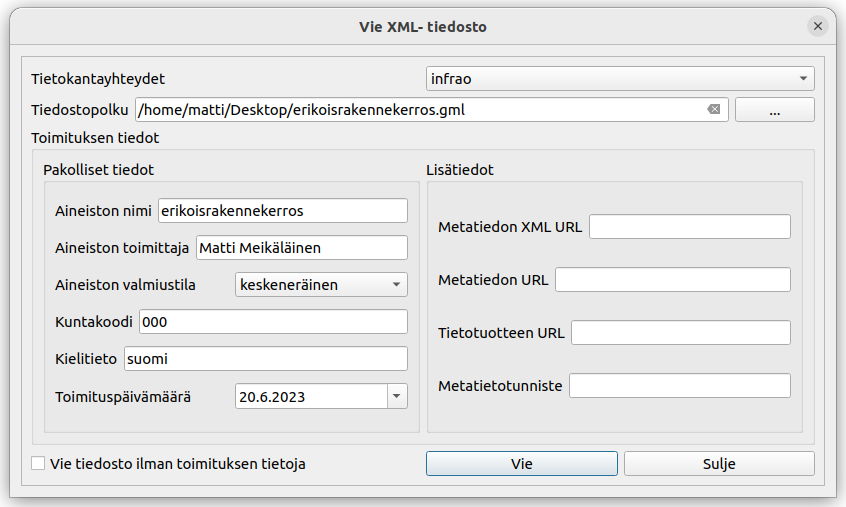
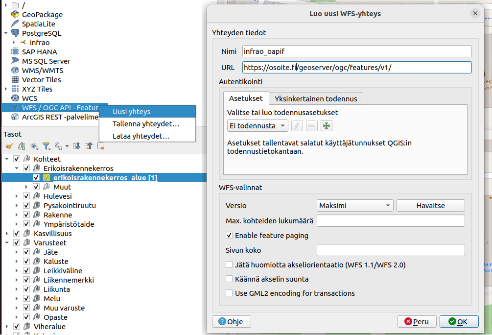

# 8. Datan tuonti (importointi) ja vienti (exportointi)

Infra-O lisäosa tarjoaa mahdollisuuden datan importointiin ja exportointiin.

## 8.1. Export

Avaa lisäosan **'Vie xml'**- työkalu. Valitse Infra-O -tietokantayhteys. Valitse sopiva tiedostopolku. Oletuksena tiedostot tallennetaan .gml- päätteellä, mutta voit valita tallennusmuodoksi myös .xml:n. Täytä vähintään pakolliset toimituksen tiedot tai valitse 'Vie tiedosto ilman toimituksen tietoja'. Klikkaa **Vie** ja tiedosto tallennetaan valitsemaasi hakemistoon.

## 8.2. Import tiedostosta

Avaa lisäosan **'Tuo xml'**- työkalu. Valitse Infra-O -tietokantayhteys. Etsi .xml tai .gml tiedosto, jonka haluat tuoda tietokantaan. Klikkaa **Tuo** ja tiedoston sisältämät tiedot tallennetaan tietokantaan ja päivittyvät QGIS- projektiin.

## 8.3. Import rajapinnalta

Muodosta ensin yhteys QGISissä Infra-O skeeman mukaista tietoa jakavaan OGC API Features- rajapintaan.

Avaa lisäosan **'Tuo xml rajapinnalta'**- työkalu. Valitse Infra-O tietokantayhteys ja OGC Api Features- yhteys. Valitse taso, jolta haluat lisätä tietoja tietokantaan. Klikkaa **Tuo**.