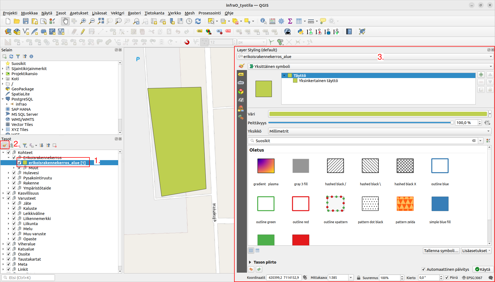

# 9. Tyylien ja visualisoinnin hallinta

Käyttäjä voi hallita eri tasojen tyylejä, ml. värejä ja nimiöitä halutessaan. Näin käyttäjä pystyy räätälöimään tietoaineistoa omiin käyttötarpeisiinsa.

1. Valitse taso, jonka tyyliä haluat muokata.
2. Avaa tyylipaneeli.
3. Muokkaa tason väritystä tai muuta tyyliä tyylipaneelissa.