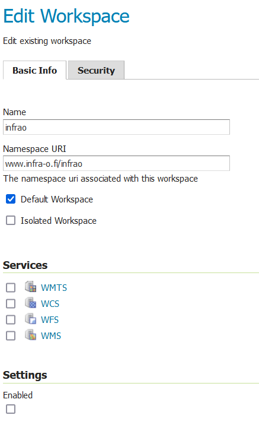
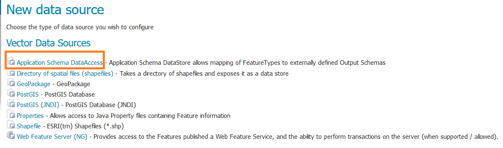

# 10. Tietojen jakelu rajapinnalta

Tämä luku ohjeistaa, miten infraomaisuuden tietoja voidaan jakaa OGC API Features- rajapinnalta Infra-O skeeman mukaisena. Rajapinnan toteutuksessa hyödynnetään GeoServer- palvelinta.

## 10.1. GeoServer- vaatimukset

Toteutus on tehty GeoServerin 2.24.SNAPSHOT- versiolla, yhteensopivuutta vanhempien versioiden kanssa ei ole testattu. OGC API Features- rajapinnan toteutus vaatii yhteisön kehittämän lisäosan serveriin, joka tulee olla asennettuna GeoServeriin. Rajapinnan GML-tulosteet on määritelty Infra-O skeeman mukaiseksi Application Schemas Extensionilla.

Vaatimukset:

-   [GeoServer- palvelin](https://geoserver.org/)

-   [OGC API- community module](https://docs.geoserver.org/latest/en/user/community/ogc-api/index.html)

-   [Application schemas extension](https://docs.geoserver.org/stable/en/user/data/app-schema/index.html)

## 10.2. Jakelutaulujen luominen tietokannassa

Jakelua varten luodaan erillinen skeema, johon luodaan tarvittavat taulut tietoineen. Taulujen luomiseen on [valmis skripti](https://raw.githubusercontent.com/GispoCoding/infraO-open/main/oapif/jakelu_tables.sql), joka luo jakelu- nimisen skeeman ja kohteita vastaavat taulut (esim. liikennemerkki_ogc, jate_ogc jne). Kohteet kopioidaan QGISissä muokattavista tauluista. Tämän vuoksi kun kohteita on lisätty tietokantaan, taulut tulee päivittää, jotta tiedot päivittyvät rajapinnalle.

## 10.3. Infra-O workspace

Jakelua varten luodaan GeoServeriin oma workspace nimeltä 'infrao'. Workspacen Namespace- asetukseksi määritetään osoite www.infra-o.fi/infrao:

{width="311"}

## 10.4. Application Schemas DataAccess- storen luominen

Application schemas lisää uuden data store- tyypin GeoServeriin nimeltä **Application Schema DataAccess**. Store vaatii kahden xml- tiedoston, jossa sen datalähteet ja skeeman kartoitus on määritetty.

GeoServerin data (tai data_dir) kansiossa tulisi olla workspaces- kansio, jonka sisällä pitäisi olla aikaisemmin luotu infrao- kansio. Tämän kansion sisälle tulee luoda etukäteen kansio Storea varten. Kansion nimeksi voi valita esimerkiksi 'ogc_jakelu'. Tähän kansioon tulee lisätä xml- tiedostot:

[includedTypes.xml](https://raw.githubusercontent.com/GispoCoding/infraO-open/main/oapif/geoserver/ogc_jakelu/includedTypes.xml)

[ogc_jakelu.xml](https://raw.githubusercontent.com/GispoCoding/infraO-open/main/oapif/geoserver/ogc_jakelu/ogc_jakelu.xml)

Näihin tiedostoihin pitää korvata tietokantayhteyden parametrit:

::: code-box
``` xml
<parameters>
    <Parameter>
        <name>host</name>
        <value>REPLACE</value>
    </Parameter>
    <Parameter>
        <name>port</name>
        <value>REPLACE</value>
    </Parameter>
    jne...
</parameters>
```
:::

Korvaa kaikki REPLACE tekstillä merkityt arvot Infra-O tietokannan tiedoilla samalla tavalla molempiin tiedostoihin. Osa parametreistä on merkitty esim. infrao/REPLACE. Näissä tapauksissa ensin mainittu oletusarvo. Mikäli oletusarvo pitää paikkansa, poista /REPLACE- teksti.

Valitulla käyttäjällä tulee olla oikeus valita (SELECT) 'jakelu'- skeeman tauluista.

Lisää GeoServerin **Stores**- välilehdeltä uusi Data Store. Valitse sen tyypiksi Application Schema DataAccess:



Kirjoita **Data Source Name**- kenttään aikaisemmin luodun xml- tiedostot sisältävän kansion nimi (esim. ogc_jakelu). Kirjoita **Connection Parameters \> URL**- kenttään linkki ogc_jakelu.xml tiedostoon:


Tallenna lopuksi Data Store.

## 10.5. Tasojen julkaiseminen

Välittömästi Data Storen luomisen jälkeen GeoServer ehdottaa uuden tason lisäämistä. Säilytä tason nimi ja otsikko oletusarvona, määritä muuten tason asetukset haluamallasi tavalla. Tason tallentamisen minivaatimuksena on koordinaattijärjestelmän ja tason laajuuden määrittäminen. Täydennä tiedot esimerkiksi näin:


Kun taso on julkaistu se löytyy välittömästä GeoServerin julkaisemasta OGC API Features- rajapinnasta. Rajapinnan GML- output on nyt Infra-O skeeman mukaista.
